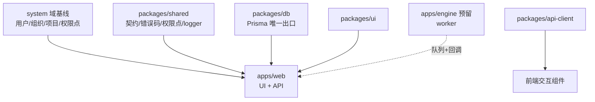

# 模块依赖关系图（骨架）

| 元信息项 | 内容                          |
| -------- | ----------------------------- |
| 文档层级 | 架构文档（全局约束）          |
| 状态     | 骨架（域 DAG 随首个域规格产出）|
| 下游消费 | 各迭代概览的依赖章节、规格元信息「上游依赖」 |

---

## 1. 运行时模块 DAG（当前实况）

产品域 DAG（业务模块间的 Provider 依赖方向）**必须随首个域规格评审时在本图补齐**，
此后每份规格的「上游依赖」字段与图一致（评审核对项）。

## 2. 禁止的依赖方向（Review 检查项，`pnpm lint:boundaries` 静态拦截）

1. `apps/engine`（引入时）不得依赖 `apps/web` 与 `packages/db`（不直连数据库，状态经队列与 HTTP 回调）
2. 下游域不得直接引用上游域 models（只能 Provider）；红线登记 `scripts/check-boundaries.domains.json`，随域评审维护
3. `packages/*` 不得依赖 `apps/*`
4. 前端 `packages/ui` 不得依赖业务 Store 与 api-client 之外的接口层
